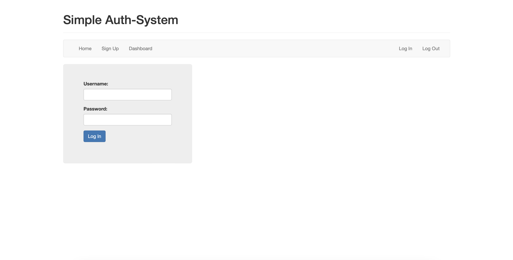

# Session-Based Authentication

## Overview
This project demonstrates a simple session-based authentication system using Node.js, Express, and MongoDB.

## Features
- User Signup
- User Login
- Dashboard Access
- Session Management

## Technologies Used
- Node.js
- Express
- MongoDB
- bcrypt for password hashing

## Installation and Setup
1. Clone the repository
   ```
   git clone https://github.com/ruchit-p/session-based-authentication.git
   ```
2. Navigate to the project directory
   ```
   cd session-based-authentication
   ```
3. Install dependencies
   ```
   npm install
   ```
4. Start the server
   ```
   npm run start
   ```

## Usage
- Open your browser and navigate to `http://localhost:3000/`
- Use the Signup page to create a new account
- Use the Login page to access the Dashboard

## Contributing
Feel free to fork the project and submit a pull request.

## License
MIT